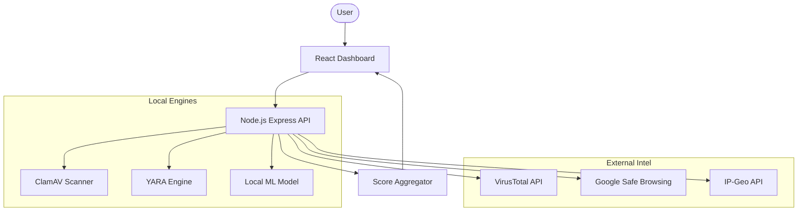

# Malware Analysis & Detection Suite

[](https://github.com/Giri227/threatscan/actions/workflows/deploy.yml)

A full-stack, production-ready system for analyzing files, URLs, and network data for malicious activity. Built with a modern React dashboard and a robust Node.js backend integrated with industry-standard security tools.

## 🚀 Features

### 1. Multi-Engine File Analysis
- **ClamAV**: Signature-based detection using the world's leading open-source antivirus engine.
- **YARA**: Rule-based detection using custom or community YARA rules.
- **ML Intelligence**: Heuristic and entropy-based machine learning models for detecting zero-day threats.
- **VirusTotal**: Real-time hash reputation lookups via the VT API.

### 2. URL Reputation & Phishing Detection
- Scans URLs using VirusTotal and local heuristics.
- Integrated with Google Safe Browsing (optional).

### 3. System Identity & Performance
- **Live IP/ISP Lookup**: Real-time geolocation and organization data for the client.
- **True Speed Test**: Precise measurement of network throughput (download) using real-world resource fetching.

### 4. Advanced Decision Engine
- **Context-Aware Scanning**: Dynamically adjusts scan profiles based on real file types (magic bytes) to eliminate false positives (e.g., ignoring Webshell rules for valid PDFs).

### 5. Professional Universal Dashboard
- **Universal Mobile Compatibility**: Fully responsive UI designed for every phone, featuring adaptive headers, flexible charts, and collapsible navigation.
- **Rich Visualizations**: Dynamic charts with Chart.js and smooth animations via Framer Motion.
- **Pro Diagnostics**: Real-time engine health indicators with one-click "Fix" instructions for missing dependencies.

### 6. 🦾 Self-Healing Architecture
- **Automatic Setup**: If local tools (ClamAV/YARA) are missing from the system PATH, the backend automatically locates and uses internal portable binaries in the `bin/` directory.
- **Local DB Initialization**: Includes pre-configured script fallbacks to ensure the virus database is always initialized.

---

## 🛠️ Architecture



---

## 📦 Setup & Installation

### Prerequisites
- Node.js v18+
- Docker (optional, recommended for production)
- ClamAV & YARA (only if running locally without Docker)

### Local Configuration
1. Clone the repository.
2. Navigate to `backend/` and create a `.env` file:
   ```env
   PORT=5000
   VT_API_KEY=your_virustotal_key
   GSB_API_KEY=your_google_key
   ```
3. Install dependencies:
   ```bash
   npm install
   ```

### Running with Docker (Recommended)
```bash
cd backend
docker build -t malware-suite-backend .
docker run -p 5000:5000 malware-suite-backend
```

---

## 🔒 Security & Limitations
- **Educational Use Only**: This tool is designed for demonstration and educational purposes.
- **No Execution**: The sandbox logic is simulated; the backend analyzes files statically and via scanning engines but does not execute them.
- **API Quotas**: Basic free tier keys for VirusTotal and Safe Browsing have daily limits. If exceeded, the tool will rely on local engines only.

---
## 📄 Documentation
- [Research Paper](RESEARCH_PAPER.md) - Technical methodology and architectural innovation.
- [Test Report](TEST_REPORT.md) - Detailed accuracy benchmarks and verification results.
- [**Installation Guide**](INSTALL_GUIDE.md) - Step-by-step setup for ClamAV, YARA, and MongoDB on Windows.

---
### Troubleshooting
If engines (ClamAV, YARA, etc.) show as **"Unavailable"**, refer to the [Installation Guide](INSTALL_GUIDE.md) to ensure all system dependencies are correctly configured in your PATH.
### Developers
Developed with ❤️ by:
- **Giridhar Pai** (@Giridhar Pai / @Giri227)
- **Jesteena Mary Oommen** (@Jesty2664)
- **WHITEHATWOLF** (@WHITEHATWOLF)
- **Luna Pheonix** (@Luna Pheonix)

*This project is also linked to the @WHITEHATWOLF professional organization.*
